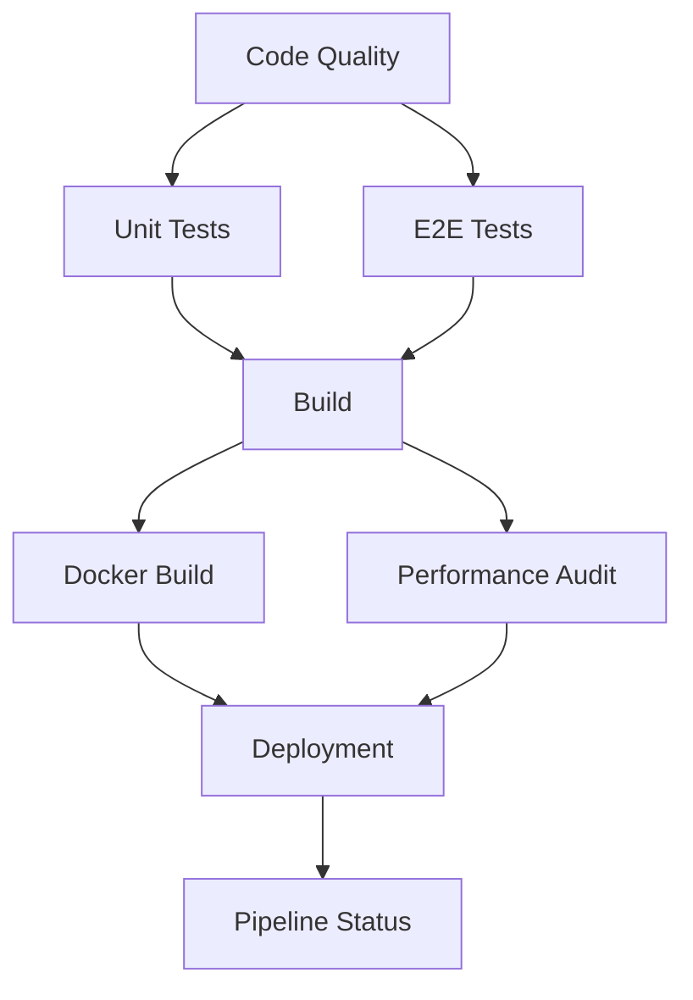

# CI/CD Pipeline Documentation

## Overview

This document describes the Continuous Integration and Continuous Deployment (CI/CD) pipeline for the HealthyMeal project. The pipeline is built using GitHub Actions and provides automated testing, building, and deployment capabilities.

## Workflows

### 1. Main CI/CD Pipeline (`main.yml`)

**Purpose**: Main pipeline for production deployment
**Triggers**: 
- Push to `main` or `master` branch
- Manual workflow dispatch

**Jobs**:
1. **Code Quality & Security** - Linting, type checking, security audit
2. **Unit Tests & Coverage** - Run unit tests with coverage reporting
3. **E2E Tests** - End-to-end testing with Playwright
4. **Build & Production Tests** - Build application and test production build
5. **Docker Build & Test** - Build and test Docker image
6. **Performance Audit** - Run performance audits and metrics
7. **Deployment** - Deploy to production (conditional)
8. **Pipeline Status** - Final summary and status

### 2. Pull Request Checks (`pull-request.yml`)

**Purpose**: Quality gates for pull requests
**Triggers**: 
- Pull request to `main` or `master`
- Push to `main` or `master`

**Jobs**:
1. **Lint Code** - ESLint and type checking
2. **Unit Tests** - Unit tests with coverage
3. **E2E Tests** - End-to-end tests
4. **Status Comment** - Comment on PR with results

### 3. Security & Dependency Management (`security.yml`)

**Purpose**: Security scanning and dependency management
**Triggers**: 
- Weekly schedule (Monday 9 AM UTC)
- Push to `main` or `master`
- Pull request
- Manual dispatch

**Jobs**:
1. **Security Scan** - npm audit and vulnerability checks
2. **Dependency Check** - Check for outdated packages
3. **License Compliance** - Verify package licenses
4. **Code Security** - Security-focused code analysis
5. **Security Summary** - Overall security status

### 4. Performance & Quality Audit (`performance.yml`)

**Purpose**: Performance monitoring and quality metrics
**Triggers**: 
- Weekly schedule (Sunday 6 AM UTC)
- Push to `main` or `master`
- Pull request
- Manual dispatch

**Jobs**:
1. **Bundle Analysis** - Analyze bundle size and composition
2. **Lighthouse Performance** - Run Lighthouse audits
3. **Code Quality Metrics** - ESLint metrics and TypeScript analysis
4. **Test Coverage Analysis** - Coverage metrics and analysis
5. **Performance Summary** - Overall performance status

### 5. Dependency Management (`dependencies.yml`)

**Purpose**: Automated dependency updates
**Triggers**: 
- Weekly schedule (Tuesday 8 AM UTC)
- Manual dispatch

**Jobs**:
1. **Check Updates** - Identify outdated dependencies
2. **Create Update PR** - Automatically create PRs for safe updates
3. **Notify Major Updates** - Alert about major version changes
4. **Dependency Summary** - Overall dependency status

### 6. Staging Deployment (`staging.yml`)

**Purpose**: Staging environment deployment
**Triggers**: 
- Push to `develop` or `staging` branch
- Pull request to `develop` or `staging`
- Manual dispatch

**Jobs**:
1. **Build for Staging** - Build and test for staging
2. **E2E Tests (Staging)** - Run E2E tests on staging
3. **Deploy to Staging** - Deploy to staging environment
4. **Performance Testing** - Performance tests on staging
5. **Staging Summary** - Staging deployment status

## Configuration

### Required Secrets

Set these secrets in your GitHub repository settings:

```bash
# Supabase Configuration
SUPABASE_URL=your_supabase_project_url
SUPABASE_ANON_KEY=your_supabase_anonymous_key
SUPABASE_SERVICE_ROLE_KEY=your_supabase_service_role_key

# OpenAI Configuration
OPENAI_API_KEY=your_openai_api_key

# Deployment URLs
BASE_URL=your_production_application_url
STAGING_BASE_URL=your_staging_application_url

# Deployment Tokens
VERCEL_TOKEN=your_vercel_deployment_token
NETLIFY_TOKEN=your_netlify_deployment_token
DIGITALOCEAN_ACCESS_TOKEN=your_digitalocean_access_token

# Server Deployment (if using custom server)
STAGING_USER=ssh_username_for_staging
STAGING_HOST=staging_server_hostname
STAGING_PATH=path_on_staging_server
PRODUCTION_USER=ssh_username_for_production
PRODUCTION_HOST=production_server_hostname
PRODUCTION_PATH=path_on_production_server
```

### Environment Variables

The workflows use the following environment variables:

```yaml
env:
  NODE_VERSION: '22.14.0'
  PNPM_VERSION: '8.15.0'
```

## Usage

### Running Workflows Manually

1. Go to your GitHub repository
2. Click on the "Actions" tab
3. Select the workflow you want to run
4. Click "Run workflow"
5. Choose the branch and click "Run workflow"

### Monitoring Workflows

- **Real-time logs**: View logs in real-time in the Actions tab
- **Artifacts**: Download build artifacts, test results, and reports
- **Notifications**: Get notified of workflow results via GitHub
- **Status checks**: View status in pull requests and commits

### Workflow Dependencies



## Performance Thresholds

### Lighthouse Scores
- **Performance**: ≥ 90
- **Accessibility**: ≥ 95
- **Best Practices**: ≥ 90
- **SEO**: ≥ 90

### Test Coverage
- **Unit Tests**: ≥ 80%
- **E2E Tests**: ≥ 70%

### Bundle Size
- **Total**: ≤ 2MB
- **JavaScript**: ≤ 1MB
- **CSS**: ≤ 500KB

## Security Requirements

### npm Audit
- **Max vulnerabilities**: 0
- **Audit level**: moderate

### Dependencies
- **Max outdated**: 10
- **Auto-update minor**: true
- **Auto-update patch**: true
- **Require review major**: true

## Deployment Strategy

### Staging
- **Auto-deploy**: true
- **Require tests**: true
- **Rollback on failure**: true

### Production
- **Auto-deploy**: false
- **Require approval**: true
- **Require tests**: true
- **Rollback on failure**: true

## Monitoring and Alerts

### Health Checks
- **Endpoint**: `/health`
- **Interval**: 5 minutes
- **Timeout**: 30 seconds
- **Retries**: 3

### Performance Monitoring
- **Lighthouse audit**: Daily
- **Bundle analysis**: On push
- **Coverage reports**: On push

### Notifications
- **Slack webhook**: Configurable
- **Email**: Configurable
- **GitHub issues**: Enabled

## Maintenance Windows

### Weekly Maintenance
- **Day**: Sunday
- **Time**: 02:00-04:00 UTC
- **Purpose**: Weekly maintenance and updates

### Dependency Updates
- **Day**: Tuesday
- **Time**: 08:00-10:00 UTC
- **Purpose**: Dependency updates and security scans

## Troubleshooting

### Common Issues

#### Workflow Fails on npm install
```bash
# Clear npm cache
npm cache clean --force

# Delete node_modules and package-lock.json
rm -rf node_modules package-lock.json

# Reinstall dependencies
npm install
```

#### Tests Fail in CI but Pass Locally
1. Check Node.js version compatibility
2. Verify environment variables are set
3. Check for platform-specific dependencies
4. Review test configuration

#### Deployment Fails
1. Verify secrets are correctly set
2. Check deployment permissions
3. Review deployment logs
4. Verify target environment is accessible

### Debug Mode

Enable debug logging by setting the secret:
```bash
ACTIONS_STEP_DEBUG=true
```

### Local Testing

Test workflows locally using [act](https://github.com/nektos/act):

```bash
# Install act
brew install act

# Run workflow locally
act -W .github/workflows/main.yml
```

## Best Practices

### Code Quality
1. Run linting before committing
2. Fix all ESLint errors and warnings
3. Maintain high test coverage
4. Use TypeScript strict mode

### Security
1. Regularly update dependencies
2. Monitor security advisories
3. Use dependency scanning tools
4. Implement proper access controls

### Performance
1. Monitor bundle size
2. Run Lighthouse audits regularly
3. Optimize images and assets
4. Use code splitting and lazy loading

### Deployment
1. Use staging environment for testing
2. Implement rollback strategies
3. Monitor deployment metrics
4. Use blue-green deployment when possible

## Support

### Resources
- [GitHub Actions Documentation](https://docs.github.com/en/actions)
- [GitHub Actions Marketplace](https://github.com/marketplace?type=actions)
- [GitHub Actions Examples](https://github.com/actions/starter-workflows)

### Getting Help
1. Check workflow logs for error details
2. Review GitHub Actions documentation
3. Search existing issues and discussions
4. Create a new issue with detailed information

## Contributing

To contribute to the CI/CD pipeline:

1. Fork the repository
2. Create a feature branch
3. Make your changes
4. Test locally using act
5. Submit a pull request
6. Ensure all checks pass

## License

This CI/CD pipeline is part of the HealthyMeal project and follows the same license terms.
